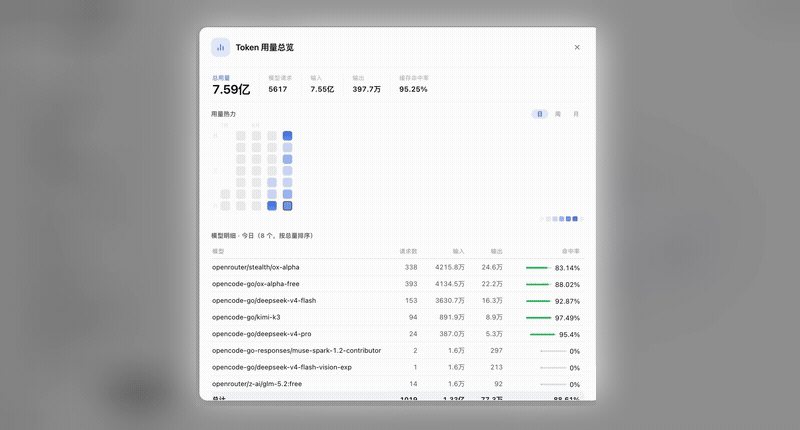

# dsh-plugin-token-usage

A DeepSeek Harness plugin that read-only scans your local session logs and renders a
**GitHub-style token usage heat map** with a granularity-linked per-model breakdown —
plus an instant "tokens today" badge on hover. Everything stays on your machine.

<!-- Demo GIF placeholder: drop your recording at docs/demo.gif and uncomment
 -->

[中文说明](./README.zh.md)

## Features

- 🔥 **GitHub-style heat map**: one cell per day for the last 30 days (zero-usage days
  filled), Sunday-first columns, month labels, today outlined; 5-level accent scale
  normalized per view.
- 🗓 **Day / Week / Month switcher**: weeks start on Sunday, aligned with grid columns;
  the color scale renormalizes per granularity.
- 🫧 **First-party tooltips**: `08-22 · 420M token · 341 requests · 95.9% cache hit`,
  left-edge aligned to each cell, shown instantly (`delayMs=0`), viewport-aware flip.
- 🧩 **Granularity-linked model table**: exact in-window aggregation via session×day and
  model×day secondary maps (no approximations), with window totals row and empty state.
- ⚡ **Sidebar hover badge**: `1.25亿token today`, silent 30s polling, rolls over at
  midnight automatically.
- 🚿 **Zero-usage filtering**: models that only produced requests but no real tokens are
  excluded from the breakdown and from request totals.
- 🌗 **Theme-native**: every color maps to DSH theme variables (`--dsw-alias-*`);
  light/dark just work.
- 🛠 **`usage_report` model tool**: ask your agent "how many tokens did I use today?"
  without opening the panel.

## Install

### Option A (recommended): one command, self-mounting

```bash
dsh plugin --profile web add dsh-plugin-token-usage
```

The package ships its own `cordis.patch.yml` bundle patch, so the host half (HTTP API +
model tool) activates automatically.

### Option B: manual mount

1. Put this directory into `~/.dsh/profiles/web/node_modules/`
   (or `pnpm add file:` it);
2. Append to `~/.dsh/profiles/web/cordis.patch.yml`:

   ```yaml
   - insert:
       - id: token-usage
         name: 'dsh-plugin-token-usage'
         config:
           ttlMs: 15000
   ```

3. Restart DeepSeek Harness.

> ⚠️ Pick one. If the bundle patch already mounts it, do NOT manually insert the same id —
> that would double-load the plugin.

## Configuration

| Key | Default | Description |
| --- | --- | --- |
| `ttlMs` | `15000` | Scan result cache duration (ms) |
| `scanTimeoutMs` | `180000` | Per-log decompression timeout (ms) |

## Usage

- **Web GUI**: click the bar-chart icon on the sidebar settings row → usage modal;
  Esc or click the backdrop to close.
- **Chat tool**: ask your agent to call `usage_report` (`refresh` forces a rescan,
  `top` caps model rows — default 10, max 50).

## Privacy

Read-only parsing of local logs under `~/.dsh/sessions/**` (streamed zstd decompression,
8-way concurrency). No network requests, no telemetry, no writes.

## License

[MIT](./LICENSE)
